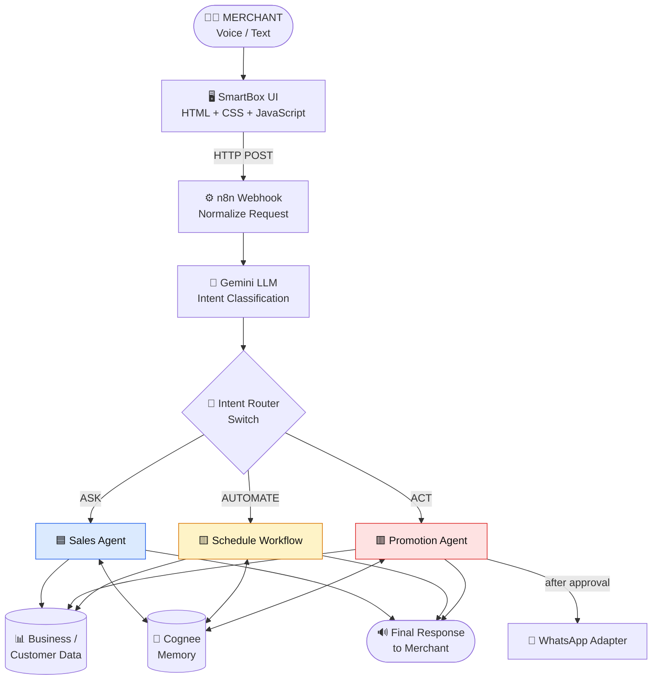
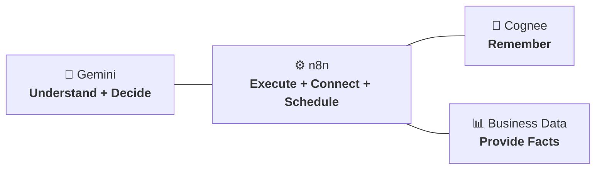

<div align="center">

# 🔊 SmartBox

### Your Paytm Soundbox, now with an AI teammate.

**A voice-first AI teammate for Paytm merchants that understands requests, remembers business context, automates repetitive work, and executes approved actions.**

<br/>


<br/>
<!--  [Demo Video](ADD_LINK) · [Live Prototype](ADD_LINK) · [Presentation](ADD_LINK) -->

</div>

---

## Paytm AI Hackathon

SmartBox is built for the **Paytm AI Hackathon - Delhi**, focused on building practical AI solutions with real-world impact.

The project combines **Google Gemini, n8n, Cognee, and a lightweight web interface** to create a conversational AI workflow for merchants.

---

## 60-Second Summary
| | |
|---|---|
| **The problem** | Merchants generate valuable data every day (sales, repeat customers, popular products) but it stays locked inside dashboards, spreadsheets and apps they don't have time to learn. |
| **Our solution** | SmartBox turns the Soundbox from a device that only *announces payments* into an AI teammate that *understands, remembers and acts*. |
| **How the merchant uses it** | Press, hold, speak in Hindi, release. SmartBox answers **in voice**. |
| **What it can do** | **ASK** questions about the business · **AUTOMATE** recurring tasks · **ACT** on approved business actions (e.g. customer promotions). |
| **What makes it different** | Voice-first · Indian-language · long-term memory · real executable workflows · human approval before any consequential action. |
| **Stack** | `Sarvam AI` (hear + speak) → `Gemini` (understand + decide) → `n8n` (execute) ↔ `Cognee` (remember) |

---

## Problem

Merchants generate valuable business data every day, but accessing and acting on it often requires switching between dashboards, spreadsheets, and messaging tools.

A traditional Soundbox announces payments. SmartBox turns that interaction into a conversational business assistant.

---

## Solution

A merchant can simply speak:

> "Aaj ki sale kitni hui?"

> "Roz raat 9 baje mujhe sales report bhejna."

> "Mere regular customers ko monthly offer bhejo."

SmartBox understands the request and routes it to the right workflow.

| Capability | Purpose | Example |
|---|---|---|
| **ASK** | Answer business questions | "Aaj ki sale kitni hui?" |
| **AUTOMATE** | Create recurring workflows | "Roz raat 9 baje sales report bhejna." |
| **ACT** | Prepare and execute approved actions | "Mere regular customers ko monthly offer bhejo." |

---

## Architecture



### Separation of responsibilities

The LLM is **not** responsible for everything. Each component has one job:



### How the stack works

```text
Gemini       → Understand and classify
Cognee       → Remember
n8n          → Execute and automate
SmartBox UI  → Interact with merchant
Render       → Deploy and host
```


> This separation makes the system **easier to control, debug and expand**. The LLM decides; n8n executes; memory persists; data supplies the facts.

---

### n8n Workflow

 

---

## Tech Stack

| Technology | Role |
|---|---|
| **n8n** | Workflow orchestration, routing, scheduling and execution |
| **Google Gemini** | Natural-language understanding and ASK / AUTOMATE / ACT classification |
| **Cognee** | Long-term merchant and customer memory |
| **HTML / CSS / JavaScript** | Voice-first merchant interface |
| **Render** | Deployment and hosting |
| **WhatsApp / API Adapter** | Customer communication |
| **Business Data Adapter** | Transaction and merchant data |

---

## Core Workflow

### ASK

```text
Merchant Request
      ↓
Gemini → ASK
      ↓
Sales Agent
      ↓
Business Data
      ↓
Final Response
      ↓
n8n Respond to Webhook
```

### AUTOMATE

```text
Merchant Request
      ↓
Gemini → AUTOMATE
      ↓
Extract task + schedule
      ↓
n8n Scheduled Workflow
      ↓
Execute recurring task
      ↓
Final Response
```

### ACT

```text
Merchant Request
      ↓
Gemini → ACT
      ↓
Cognee Memory
      ↓
Customer / Business Context
      ↓
Prepare Action
      ↓
Merchant Approval
      ↓
Execute
      ↓
Final Response
```

---

## Memory

SmartBox uses Cognee to retain relevant business context.

Example:

> "Customers ko Hindi mein message karna aur discount 10% se zyada mat dena."

This preference can be retrieved later when SmartBox prepares a promotion.

Memory areas include:

- Merchant preferences
- Customer history
- Business context
- Previous interactions

---

## Human-in-the-Loop

Read-only requests can be handled automatically.

Consequential actions use merchant approval before execution.

```text
READ
  → Automatic

ACT
  → Prepare
  → Merchant Approval
  → Execute
  → Verify
```

---

## Demo:

| The merchant says | Intent | What SmartBox does |
|---|---|---|
| *"Aaj ki sale kitni hui?"* | 🟦 `ASK` | Reads today's sales and replies in voice: *"Aaj ki total sale ₹23,450 hai aur 126 transactions hue hain."* |
| *"Roz raat 9 baje mujhe sales report bhejna."* | 🟨 `AUTOMATE` | Extracts task + frequency + time and turns it into a scheduled n8n workflow. |
| *"Mere regular customers ko monthly ration ka offer bhejo."* | 🟥 `ACT` | Finds regular customers, applies remembered preferences, drafts a message, asks for approval, sends, verifies, remembers. |
| *"Mere customers ko Hindi mein message karna."* | 🧠 Memory | Stores *language = Hindi* as a permanent merchant preference. |
| *"10% se zyada discount mat dena."* | 🧠 Memory | Stores *max discount = 10%* as a business rule. Later offers respect it automatically. |

---

## Run Locally

```bash
git clone https://github.com/Purvijain1234/Paytm-SmartBox.git
cd Paytm-SmartBox
python -m http.server 8000
```

Open:

```text
http://localhost:8000
```

### n8n Setup

1. Import the SmartBox workflow into n8n.
2. Add Google Gemini and Cognee credentials.
3. Configure the Cognee datasets.
4. Activate the n8n webhook.
5. Update the webhook URL in `app.js`.

---

## Team

| Name | GitHub |
|---|---|
| **Purvi Jain** | [@Purvijain1234](https://github.com/Purvijain1234) |
| **Ranjeet Singh** | [@ranjeet22](https://github.com/ranjeet22) |

---

<div align="center">

**SmartBox - Voice → Understand → Remember → Automate → Act**

Built for the Paytm AI Hackathon.

</div>
