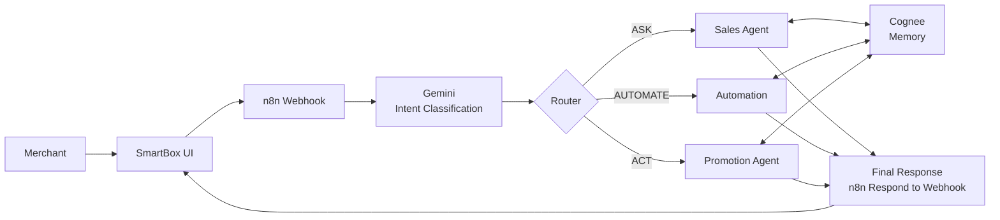

<div align="center">

# SmartBox

### Your Paytm Soundbox, now with an AI teammate.

**A voice-first AI teammate for Paytm merchants that understands requests, remembers business context, automates repetitive work, and executes approved actions.**

<!--  [Demo Video](ADD_LINK) · [Live Prototype](ADD_LINK) · [Presentation](ADD_LINK) -->

</div>

---

## Paytm AI Hackathon

SmartBox is built for the **Paytm AI Hackathon - Delhi**, focused on building practical AI solutions with real-world impact.

The project combines **Google Gemini, n8n, Cognee, and a lightweight web interface** to create a conversational AI workflow for merchants.

---

## Problem

Merchants generate valuable business data every day, but accessing and acting on it often requires switching between dashboards, spreadsheets, and messaging tools.

A traditional Soundbox announces payments. SmartBox turns that interaction into a conversational business assistant.

---

## Solution

A merchant can simply speak:

> "Aaj ki sale kitni hui?"

> "Roz raat 9 baje mujhe sales report bhejna."

> "Mere regular customers ko monthly offer bhejo."

SmartBox understands the request and routes it to the right workflow.

| Capability | Purpose | Example |
|---|---|---|
| **ASK** | Answer business questions | "Aaj ki sale kitni hui?" |
| **AUTOMATE** | Create recurring workflows | "Roz raat 9 baje sales report bhejna." |
| **ACT** | Prepare and execute approved actions | "Mere regular customers ko monthly offer bhejo." |

---

## Architecture



### n8n Workflow


---

## Tech Stack

| Technology | Role |
|---|---|
| **n8n** | Workflow orchestration, routing, scheduling and execution |
| **Google Gemini** | Natural-language understanding and ASK / AUTOMATE / ACT classification |
| **Cognee** | Long-term merchant and customer memory |
| **HTML / CSS / JavaScript** | Voice-first merchant interface |
| **Render** | Deployment and hosting |
| **WhatsApp / API Adapter** | Customer communication |
| **Business Data Adapter** | Transaction and merchant data |

### How the stack works

```text
Gemini       → Understand and classify
Cognee       → Remember
n8n          → Execute and automate
SmartBox UI  → Interact with merchant
Render       → Deploy and host
```

---

## Core Workflow

### ASK

```text
Merchant Request
      ↓
Gemini → ASK
      ↓
Sales Agent
      ↓
Business Data
      ↓
Final Response
      ↓
n8n Respond to Webhook
```

### AUTOMATE

```text
Merchant Request
      ↓
Gemini → AUTOMATE
      ↓
Extract task + schedule
      ↓
n8n Scheduled Workflow
      ↓
Execute recurring task
      ↓
Final Response
```

### ACT

```text
Merchant Request
      ↓
Gemini → ACT
      ↓
Cognee Memory
      ↓
Customer / Business Context
      ↓
Prepare Action
      ↓
Merchant Approval
      ↓
Execute
      ↓
Final Response
```

---

## Memory

SmartBox uses Cognee to retain relevant business context.

Example:

> "Customers ko Hindi mein message karna aur discount 10% se zyada mat dena."

This preference can be retrieved later when SmartBox prepares a promotion.

Memory areas include:

- Merchant preferences
- Customer history
- Business context
- Previous interactions

---

## Human-in-the-Loop

Read-only requests can be handled automatically.

Consequential actions use merchant approval before execution.

```text
READ
  → Automatic

ACT
  → Prepare
  → Merchant Approval
  → Execute
  → Verify
```

---

## Demo

### ASK

**"Aaj ki sale kitni hui?"**

SmartBox retrieves sales information and returns the result through the final n8n response.

### AUTOMATE

**"Roz raat 9 baje mujhe sales report bhejna."**

SmartBox converts the request into a scheduled n8n workflow.

### ACT

**"Mere regular customers ko monthly offer bhejo."**

SmartBox uses memory and customer context to prepare the action and requests merchant approval before execution.

---

## Run Locally

```bash
git clone https://github.com/Purvijain1234/Paytm-SmartBox.git
cd Paytm-SmartBox
python -m http.server 8000
```

Open:

```text
http://localhost:8000
```

### n8n Setup

1. Import the SmartBox workflow into n8n.
2. Add Google Gemini and Cognee credentials.
3. Configure the Cognee datasets.
4. Activate the n8n webhook.
5. Update the webhook URL in `app.js`.

---

## Deployment

The application can be deployed using **Render**.

```text
GitHub Repository
      ↓
Render
      ↓
SmartBox Web Interface
      ↓
n8n Webhook
      ↓
Gemini / Cognee / Business Workflows
```

---

## Team

| Name | GitHub |
|---|---|
| **Purvi Jain** | [@Purvijain1234](https://github.com/Purvijain1234) |
| **Ranjeet Singh** | [@ranjeet22](https://github.com/ranjeet22) |

---

<div align="center">

**SmartBox - Voice → Understand → Remember → Automate → Act**

Built for the Paytm AI Hackathon.

</div>
